# 👕 Awesome Fashion Product Lifecycle Management (PLM)

  
  
  
  

> **A curated list of top SaaS platforms, commercial software, and open-source GitHub projects for Fashion Product Lifecycle Management (PLM), tech packs, BOM management, apparel sourcing, and seasonal workflows.**

---

## 📚 Table of Contents

- [🌐 Sector Overview & Market Dynamics](#-sector-overview--market-dynamics)
- [☁️ SaaS & Hosted Commercial Platforms](#️-saas--hosted-commercial-platforms)
- [⚡ Open-Source GitHub Projects](#-open-source-github-projects)
- [💡 Implementation & Custom Systems Guide](#-implementation--custom-systems-guide)
- [🤝 How to Contribute](#-how-to-contribute)
- [💖 Support & Sponsorship](#-support--sponsorship)
- [⚠️ Disclaimer](#️-disclaimer)
- [📈 Star History](#-star-history)

---

## 🌐 Sector Overview & Market Dynamics

The global **Fashion Product Lifecycle Management (PLM) software market** is estimated at approximately **$1.8 Billion to $2.2 Billion** and is projected to grow at a CAGR of ~8.5% through 2030, driven by rapid digitization, sustainability tracking, digital sample reduction (3D CAD/CLO 3D integration), and supply chain transparency.

**Market Fragmentation:** The sector is **moderately concentrated** at the high-end enterprise level (dominated by legacy giants like PTC FlexPLM, Lectra, and Centric Software), while remaining **highly fragmented** across mid-market and SMB fashion brands where modern cloud-native SaaS startups (Backbone PLM, WFX) and general-purpose open-source ERP systems (Odoo, ERPNext) actively compete.

---

## ☁️ SaaS & Hosted Commercial Platforms

> *Platforms are sorted in descending order by company scale (Revenue / Valuation).*

| Product Name | Description & Key Strengths | Company Scale (Rev / Val) | Starting Pricing | Free Tier / Trial Limits |
| :--- | :--- | :--- | :--- | :--- |
| **[PTC FlexPLM](https://www.ptc.com/)** 🏢 | Enterprise-grade PLM solution for global retail and apparel giants with extensive supply-chain integration. | **~$2.1 Billion** annual revenue (PTC Parent) | ~$1,200 / user / year | **No free tier**; 14-day enterprise demo on request |
| **[Lectra Kubix Link](https://www.lectra.com/)** ✂️ | Fashion PLM & visual collaboration platform seamlessly connected to Lectra 2D/3D cutting & pattern ecosystem. | **~$570 Million** annual revenue | ~$800 / user / year | **No free tier**; custom request 14-day guided trial |
| **[Centric PLM](https://www.centricsoftware.com/)** 🏷️ | Market-leading fashion, apparel, and retail PLM used by mid-market to enterprise global brands. | **~$200 Million+** annual revenue (Dassault Systèmes subsidiary) | ~$150 / user / month (~$1,800/yr) | **No free tier**; 14-day interactive demo sandbox |
| **[Aptean Apparel PLM](https://www.aptean.com/)** 🏭 | End-to-end enterprise software covering product development, factory management, and compliance. | **~$400 Million+** revenue ($1B+ Valuation) | ~$100 / user / month | **No free tier**; 30-day guided evaluation |
| **[CGS BlueCherry PLM](https://www.cgsinc.com/)** 📦 | Comprehensive apparel PLM tightly coupled with BlueCherry ERP for fashion production & sourcing. | **~$250 Million** annual revenue | ~$95 / user / month | **No free tier**; custom 14-day demo environment |
| **[DeSL PLM](https://www.desl.com/)** 🧵 | Modular cloud PLM for apparel & footwear covering tech packs, digital color management, and vendor portals. | **~$50 Million** estimated revenue | ~$75 / user / month | **No free tier**; 14-day full feature trial on request |
| **[Gerber YuniquePLM](https://www.gerbertechnology.com/)** 📐 | Cloud fashion PLM enabling collaborative style development and tech pack creation (Lectra Group). | **~$50 Million** revenue (sub-division) | ~$126 / user / month | **No free tier**; 14-day free trial (up to 3 users) |
| **[WFX PLM](https://www.worldfashionexchange.com/)** 🌏 | Cloud-native fashion PLM tailored for mid-market apparel brands with rapid onboarding & supplier portals. | **~$20 Million** estimated revenue | ~$49 / user / month | **No free tier**; 14-day full access free trial |
| **[Backbone PLM](https://www.backboneplm.com/)** 🚀 | Modern, user-friendly cloud PLM designed for emerging fashion brands, DTC labels, and boutique studios. | **~$10 Million** revenue ($30M+ Valuation) | ~$99 / user / month | **No free tier**; 14-day free trial (max 5 tech packs) |
| **[Visual PLM](https://www.visualnext.com/)** 🎨 | Visual product development and line-planning tool built specifically for apparel and footwear teams. | **~$10 Million** estimated revenue | ~$65 / user / month | **No free tier**; 14-day custom demo sandbox |

---

## ⚡ Open-Source GitHub Projects

> *Repositories are sorted in descending order by GitHub Stars_Count.*

- **[Odoo](https://github.com/odoo/odoo/stargazers)**  📦  
  Comprehensive open-source ERP framework featuring extensible Product Lifecycle Management (PLM), BOM variants, fabric tracking, and apparel manufacturing modules.

- **[ERPNext](https://github.com/frappe/erpnext/stargazers)**  🛠️  
  Full-featured open-source ERP with native items, multi-level Bill of Materials (BOM), variant attributes (size/color), and production workflow engines adapted by apparel SMBs.

- **[InvenTree](https://github.com/inventree/InvenTree/stargazers)**  🏷️  
  Open-source inventory management and product stock control system with strong supplier cataloging, BOM tracking, and part variant support.

- **[Cascadia PLM](https://github.com/cascadia-plm/cascadia-plm/stargazers)**  🌲  
  Code-first, modern AGPL-licensed open-source PLM with a unified item model, change request workflows, and modern web interface.

- **[Dokuly](https://github.com/Dokuly-PLM/dokuly/stargazers)**  📄  
  Open-source Product Lifecycle Management (PLM) system focusing on part numbering, revision control, document management, BOM creation, and release lifecycles.

- **[GitPLM](https://github.com/git-plm/git-plm/stargazers)**  🐙  
  Git-native PLM philosophy treating parts, specifications, and BOM sheets as structured text files under complete version control with pull request reviews.

- **[OpenPLM](https://github.com/openplm/openplm/stargazers)**  🐍  
  Classic Python/Django open-source PLM system designed to manage documents, CAD files, engineering structures, and revision histories.

- **[PLMore](https://github.com/PLMore/PLMore/stargazers)**  💡  
  Community open-source PLM initiative focused on lightweight, developer-friendly architecture for modern hardware and product development.

---

## 💡 Implementation & Custom Systems Guide

Commercial fashion PLM platforms (Centric, PTC, Lectra) excel at specialized domain workflows:
- **Seasonal Line Boards & Visual Planning**
- **Tech Pack Generation & Measurement Spec Sheets**
- **Fabric & Trim Material Libraries**
- **3D CAD / CLO 3D Integration**

### 🏗️ Open-Source Custom Stack Architecture
For early-stage apparel startups or lean tech-driven brands, a hybrid open architecture provides substantial flexibility:
1. **Product Data & Master BOM**: Hosted in [ERPNext](https://github.com/frappe/erpnext) or [Odoo](https://github.com/odoo/odoo).
2. **Document & Tech Pack Control**: Managed in [Dokuly](https://github.com/Dokuly-PLM/dokuly) or structured Git repositories ([GitPLM](https://github.com/git-plm/git-plm)).
3. **Supplier & Sample Tracking**: Integrated via REST APIs or custom web forms.

---

## 🤝 How to Contribute

1. Fork this repository. 🍴
2. Add your entry or correction in `README.md` maintaining proper table or list formatting.
3. Ensure links are active and descriptions are concise.
4. Submit a Pull Request (PR) with a short description of the changes.

---

## 💖 Support & Sponsorship

If you found this curated list helpful for your fashion tech stack or product development research, please consider supporting the maintenance of this repository!

- ⭐ **Star this repository** to help others discover it.
- 🔀 **Fork & Share** with product developers, apparel teams, and fashion tech advocates.
- ☕ **Buy me a coffee / Sponsor**: Support further open-source updates on [GitHub Sponsors](https://github.com/sponsors/ishandutta2007).

---

## ⚠️ Disclaimer

This repository is community-curated for informational purposes only. It is not an endorsement of any commercial platform or open-source project. Product lifecycle management systems handle sensitive financial, supplier, and intellectual property data—always perform proper security audits before deployment.

---

## 📈 Star History

